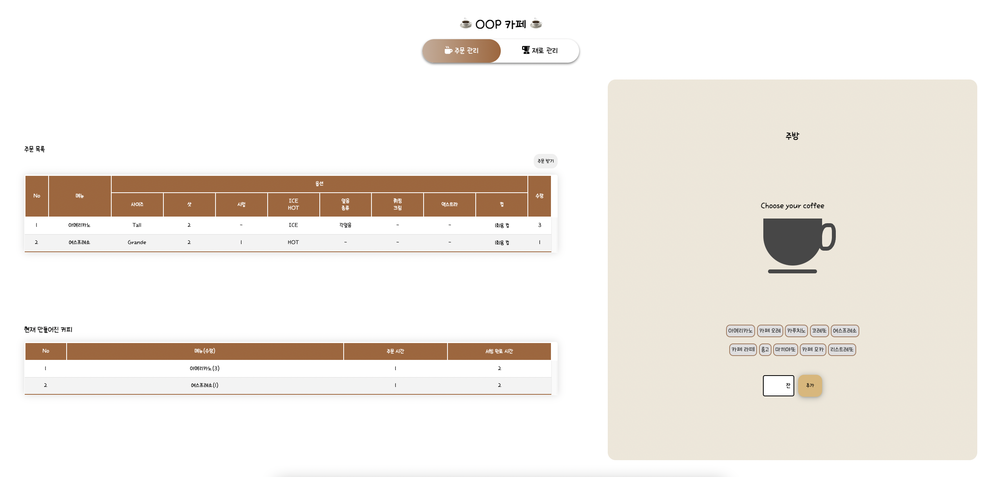

<br/>

<div align=center>

<h1>☕ 타입스크립트 객체 지향 카페 ☕</h1>
<code>객체를 설계하고 상태를 고민하는 OOP 카페 앱</code>

<br/>

<p align=center>
  &nbsp
  &nbsp
  &nbsp
  &nbsp 
</p>

<br/>



<br/>

</div>

<br/>

## ⚙️ BEFORE STARTED

```sh
# clone repository
git clone https://github.com/FECrash/TypeScript-OOP.git

# change directory
cd ./TypeScript-OOP

# install
npm install # or npm i

# run
npm run dev

# build
npm run build
```

<br/>

## 📖 TEMPLATE

### 🏷 주문 관리

```html
<main id="order">
  <section id="left-section">
    <div class="order-list">
      <h1>주문 목록</h1>
      <div class="order-button-area">
        <button class="order-button">주문 받기</button>
      </div>
      <div class="wrapper">
        <div class="table">
          <div class="table-row header">
            <div class="cell">No</div>
            <div class="cell">메뉴명</div>
            <div class="cell">사이즈</div>
            <div class="cell">샷</div>
            <div class="cell">시럽</div>
            <div class="cell">ICE/HOT</div>
            <div class="cell">얼음 종류</div>
            <div class="cell">휘핑 크림</div>
            <div class="cell">엑스트라</div>
            <div class="cell">컵</div>
            <div class="cell">수정하기</div>
            <div class="cell">삭제하기</div>
          </div>
          <div class="table-row">
            <div class="cell" data-title="No">1</div>
            <div class="cell" data-title="메뉴명">아메리카노</div>
            <div class="cell" data-title="사이즈">Tall</div>
            <div class="cell" data-title="샷">2</div>
            <div class="cell" data-title="시럽">-</div>
            <div class="cell" data-title="ICE/HOT">ICE</div>
            <div class="cell" data-title="얼음 종류">각얼음</div>
            <div class="cell" data-title="휘핑 크림">-</div>
            <div class="cell" data-title="엑스트라">-</div>
            <div class="cell" data-title="컵">1회용 컵</div>
            <div class="cell" data-title="수정하기">
              <span class="edit-order"><i class="fa-solid fa-pen"></i></span>
            </div>
            <div class="cell" data-title="삭제하기">
              <span class="remove-order"><i class="fa-solid fa-trash-can"></i></span>
            </div>
          </div>
        </div>
      </div>
    </div>
    <span class="maked-list-view">
      <button>현재까지 서빙된 커피 확인하기</button>
    </span>
    <div class="maked-list">
      <h1>현재까지 서빙된 커피</h1>
      <div class="wrapper">
        <div class="table">
          <div class="table-row header">
            <div class="cell">No</div>
            <div class="cell">메뉴(수량)</div>
            <div class="cell">주문 시간</div>
            <div class="cell">서빙 완료 시간</div>
          </div>
          <div class="table-row">
            <div class="cell" data-title="No">1</div>
            <div class="cell" data-title="메뉴(수량)">아메리카노(3)</div>
            <div class="cell" data-title="주문 시간">2022.05.02 20:44:32</div>
            <div class="cell" data-title="서빙 완료 시간">2022.05.02 20:46:17</div>
          </div>
          <div class="table-row">
            <div class="cell" data-title="No">1</div>
            <div class="cell" data-title="메뉴(수량)">에스프레소(1)</div>
            <div class="cell" data-title="주문 시간">2022.05.02 20:51:37</div>
            <div class="cell" data-title="서빙 완료 시간">2022.05.02 20:53:11</div>
          </div>
        </div>
      </div>
    </div>
  </section>
  <section id="right-section">
    <h1>주방</h1>
    <div class="coffee-container">
      <h1 class="coffee_name">Choose your coffee</h1>
      <div class="cup">
        <div class="filling reset">
          <div class="coffee">커피</div>
          <div class="water">물</div>
          <div class="liquor">리퀴르</div>
          <div class="milk">우유</div>
          <div class="whipped_cream">휘핑 크림</div>
          <div class="milk_foam">밀크 폼</div>
          <div class="steamed_milk">데운 우유</div>
          <div class="chocolate">초콜릿</div>
        </div>
        <div class="plate"></div>
      </div>
    </div>
    <div class="select-coffee-container">
      <div class="row">
        <div>
          <button class="coffee-category-button" id="americano">아메리카노</button>
          <button class="coffee-category-button" id="au_lait">카페 오레</button>
          <button class="coffee-category-button" id="capuccino">카푸치노</button>
          <button class="coffee-category-button" id="corretto">코레또</button>
          <button class="coffee-category-button" id="espresso">에스프레소</button>
        </div>
        <div>
          <button class="coffee-category-button" id="latte">카페 라떼</button>
          <button class="coffee-category-button" id="lungo">룽고</button>
          <button class="coffee-category-button" id="macchiato">마끼야또</button>
          <button class="coffee-category-button" id="mocha">카페 모카</button>
          <button class="coffee-category-button" id="ristretto">리스트레또</button>
        </div>
      </div>
      <div class="row">
        <div class="coffee-add-area">
          <form>
            <button type="submit" class="coffee-add-options-button">만들기</button>
          </form>
        </div>
      </div>
    </div>
  </section>
</main>
```

<br/>

### 🧾 재료 관리

> CSS 구현 중이에요😖

```html
<main id="material">
  <section id="top">
    <h3>재료 추가하기</h3>
    <form autocomplete="" class="material-add-form">
      <input type="text" name="material-name" placeholder="추가할 상품명" required="" autofocus="" maxlength="20" />
      <input type="number" name="material-price" placeholder="추가할 상품 금액" required="" min="100" step="10" />
      <input type="number" name="material-quantity" placeholder="추가할 상품 수량" required="" min="1" step="1" />
      <button type="submit" id="material-add-button">추가하기</button>
    </form>
  </section>
  <section id="bottom">
    <h3>재료 현황</h3>
    <table class="material-inventory">
      <thead>
        <tr>
          <th>재료명</th>
          <th>가격</th>
          <th>수량</th>
          <th>관리</th>
        </tr>
      </thead>
      <tbody>
        <tr>
          <td data-material-name="커피 원두">커피 원두</td>
          <td data-material-price="1000">1,000원</td>
          <td data-material-quantity="10">10봉지</td>
          <td>
            <button type="button" class="delete-material" data-delete="커피 원두">삭제하기</button>
          </td>
        </tr>
      </tbody>
    </table>
  </section>
</main>
```

```html
<!-- 재료 추가 시 -->
<form>
  <select name="material" id="material-select">
    <option value="">재료를 선택해주세요!</option>
    <option value="coffee">커피</option>
    <option value="water">물</option>
    <option value="liquor">리퀴르</option>
    <option value="milk">우유</option>
    <option value="whipped_cream">휘핑 크림</option>
    <option value="milk_foam">밀크 폼</option>
    <option value="steamed_milk">데운 우유</option>
    <option value="chocolate">초콜릿</option>
  </select>
  <input type="text" />
</form>
```

<br/>

## 💎 MISSION

### 📂 Info

> 커피 제조법

- ☕ 아메리카노: (물 `6`, 커피 `4`)

- ☕ 카페 오레: (우유 `5`, 커피 `5`)

- ☕ 카푸치노: (커피 `3.5`, 데운 우유 `3`, 밀크 폼 `3.5`)

- ☕ 코레또: (커피 `5.5`, 리퀴르 `2`)

- ☕ 에스프레소: (커피 `4`)

- ☕ 카페 라떼: (커피 `4`, 데운 우유 `4`, 밀크 폼 `2`)

- ☕ 룽고: (커피 `5`, 물 `5`)

- ☕ 마끼야또: (커피 `3`, 밀크 폼 `7`)

- ☕ 카페 모카: (커피 `4`, 초콜릿 `2`, 데운 우유 `2`, 휘핑 크림 `2`)

- ☕ 리스트레또: (커피 `2`)

<br/>

### 💻 1st week : 온보딩 + Vanilla JavaScript 적응기

#### 📝 설계

- [UML 그리기](https://app.diagrams.net/)

<br/>

#### 💡 기능

- [x] 주문 받기를 클릭하면 랜덤으로 주문 목록 테이블에 추가됩니다.
- [ ] 주문 목록의 `수정하기`를 클릭하면 해당 주문을 수정할 수 있습니다.
  - TIP: `div 태그에 contenteditable 속성을 부여합니다.`
- [ ] 주문 목록의 `삭제하기`를 클릭하면 해당 주문이 삭제됩니다.
- [ ] 주문이 존재하지 않으면 주방의 `커피 선택 버튼`이 `비활성` 됩니다.
  - 가령 `아메리카노 하나만 주문 목록에 존재하면 아메리카노 버튼만 활성화` 되어야 합니다.
  - 아무 주문도 없다면 주방은 `CLOSE` 됩니다.
    ```html
    <section id="right-section">
      <div id="none-order"></div>
    </section>
    ```
- [ ] 주문이 존재하지 않음에도 `커피 선택 버튼`이나 `만들기` 버튼을 클릭하면 `경고창`을 출력합니다.

<br/>

### 💻 2nd week : 구조/프로세스 설계

- [ ] `주문 관리 탭`을 클릭하면 `커피를 주문하고 만드는 화면`으로 전환됩니다.
- [ ] `재료 관리 탭`을 클릭하면 `커피 재료를 관리하는 화면`으로 전환됩니다.
- [ ] 만들 커피가 선택되어 `만들기 버튼`을 클릭하면 옵션을 설정하는 `Modal 창이 출력`됩니다.
- [ ] 출력되는 Modal 창의 상단에는 `해당되는 커피 목록`이 출력됩니다.
- [ ] 커피는 반드시 가장 위에 있는 `주문 순서대로 서빙`되어야 합니다.
- [ ] 옵션이 `제대로 추가되지 않은 채` `커피 서빙하기 버튼`을 클릭하면 `경고창`을 출력합니다.
- [ ] 만약 커피를 서빙하지 않고 Modal 창이 닫혔다면 해당 작업 내역은 `저장`되어야 합니다.
  - 다시 Modal 창을 출력하는 경우 `마지막으로 선택한 옵션들이 체크`되어야 합니다.
- [ ] 정상적으로 커피가 서빙 되었다면 `알림창`을 출력하고 `커피 선택 레이어`와 `Modal 창의 작업 내용`을 `초기화` 합니다.
- [ ] 정상적으로 커피가 서빙 되었다면 `현재까지 서빙된 커피 테이블`에 추가됩니다.
  - `주문한 순서대로` 목록이 추가됩니다.
  - 동일한 커피가 주문되면 `괄호 안의 수량이 증가`됩니다.
  - 동일한 커피가 주문되면 `최근 주문 시간`과 `최근 서빙 완료 시간`이 갱신됩니다.
- [ ] 정상적으로 커피가 서빙 되었다면 `주문 목록 테이블`의 주문에 `삭선 처리`합니다.

<br/>

### 💻 3rd week : Web Storage

- [ ] 웹을 다시 접속해도 기존 상태가 `유지` 되어야 합니다.
- [ ] 상태를 관리하는 무언가는 단독으로 사용하지 않고 `객체 또는 모듈화` 되어야 합니다.

<br/>

### 💻 4th week : Promise/Loading

- [ ] `주문받기` 버튼 클릭 시 `1초의 Delay`가 존재해야 합니다.

  - 1초 동안 `Loading 화면`을 출력합니다. Loading Icon은 `assets/images/coffee-cup.gif` 입니다.

- [ ] `커피 서빙하기` 버튼 클릭 시 `2초의 Delay`가 존재해야 합니다.
  - 2초 동안 `Loading 화면`을 출력합니다. Loading Icon은 `assets/images/coffee-cup.gif` 입니다.

<br/>

### 🧸 추가 기능

- [ ] 만들 커피의 수량을 지정할 수 있습니다.

  ```html
  <div class="row">
    <div class="coffee-add-area">
      <form>
        <input
          type="text"
          oninput="this.value = this.value.replace(/[^0-9.]/g, ''); this.value = this.value.replace(/(\..*)\./g, '$1');"
          maxlength="2"
        />
        <span class="ms">잔</span>
        <button type="submit" class="coffee-add-options-button">추가</button>
      </form>
    </div>
  </div>
  ```

- [ ] ~~Server에 데이터를 저장합니다.~~
  - 2022.05.06 부 구현되지 않은 요구사항입니다.

<br/>

## 📔 COMMIT CONVENTION

| 태그                     | 설명                                                                      |
| ------------------------ | ------------------------------------------------------------------------- |
| `✒️Feat: `               | 새로운 기능을 추가할 경우                                                 |
| `🛠Fix: `                 | 버그를 고친 경우                                                          |
| `✍️Design: `             | CSS 등 사용자 UI 디자인 변경                                              |
| `❗️♻️BREAKING CHANGE: ` | 커다란 API 변경의 경우                                                    |
| `❗️✔️HOTFIX: `          | 급하게 치명적인 버그를 고쳐야하는 경우                                    |
| `🎆Style: `              | 코드 포맷 변경, 세미 콜론 누락, 코드 수정이 없는 경우                     |
| `🗃Refactor: `            | 프로덕션 코드 리팩토링                                                    |
| `💬Comment: `            | 필요한 주석 추가 및 변경                                                  |
| `📝Docs: `               | 문서를 수정한 경우                                                        |
| `🧪Test: `               | 테스트 추가, 테스트 리팩토링(프로덕션 코드 변경 X)                        |
| `🔬Chore: `              | 빌드 태스트 업데이트, 패키지 매니저를 설정하는 경우(프로덕션 코드 변경 X) |
| `✂️Rename: `             | 파일 혹은 폴더명을 수정하거나 옮기는 작업만인 경우                        |
| `🧺Remove: `             | 파일을 삭제하는 작업만 수행한 경우                                        |

<br/>

## 📜 LICENSE

[MIT](https://opensource.org/licenses/MIT)

<br/>
