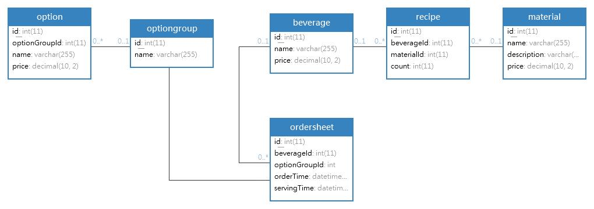
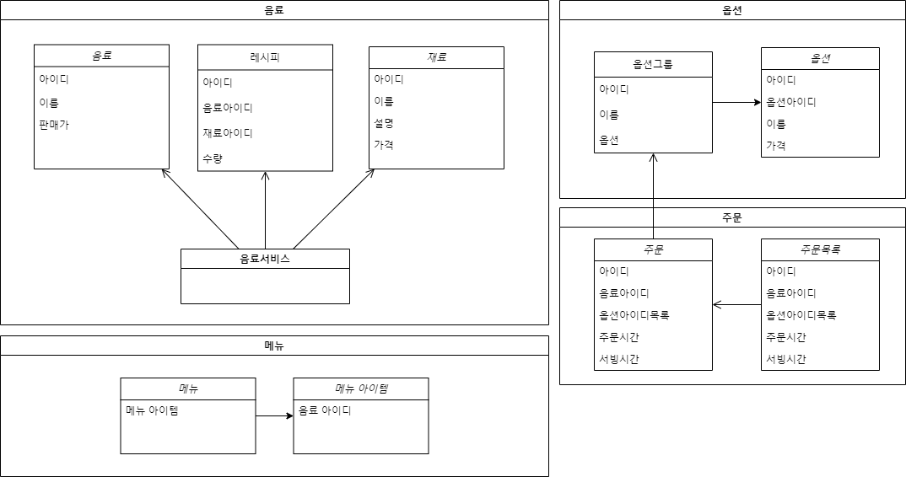

#타입스크립트 객체 지향 카페

## 1주차 

### 커피의 종류

- ☕ 아메리카노: (물 `6`, 커피 `4`)
- ☕ 카페 오레: (우유 `5`, 커피 `5`)
- ☕ 카푸치노: (커피 `3.5`, 데운 우유 `3`, 밀크 폼 `3.5`)
- ☕ 코레또: (커피 `5.5`, 리퀴르 `2`)
- ☕ 에스프레소: (커피 `4`)
- ☕ 카페 라떼: (커피 `4`, 데운 우유 `4`, 밀크 폼 `2`)
- ☕ 룽고: (커피 `5`, 물 `5`)
- ☕ 마끼야또: (커피 `3`, 밀크 폼 `7`)
- ☕ 카페 모카: (커피 `4`, 초콜릿 `2`, 데운 우유 `2`, 휘핑 크림 `2`)
- ☕ 리스트레또: (커피 `2`)

### 요구사항
- 기본적으로 커피는 1잔씩 나갑니다. 주문받기를 여러개 눌러도 한 번에 만들 수 있는 커피는 1잔이에요.
  - 가령 주문받기를 5개 눌렀다고 생각해 볼까요? 1. 아메리카노, 2. 아메리카노, 3. 에스프레소, 4. 룽고, 5. 에스프레소가 나왔습니다.
  - 만들 수 있는 커피는 “아메리카노, 에스프레소, 룽고” 세 종류에요.
  - 에스프레소를 선택하고 만들기 버튼을 클릭하면 모달 창이 열리고, 모달 창의 상단에 테이블로 표기된 커피 정보는 3. 에스프레소 정보가 나와야 합니다. 3은 No 컬럼이에요.
- 옵션을 정상적으로 선택해서 커피 서빙이 완료되면 모달 창이 닫히고, 주문 목록에서 3. 에스프레소가 삭제되고 서빙을 완료한 목록에 추가됩니다.
  - 해당 테이블은 커피가 최초 주문되어 로우가 그려지는 경우 CREATE, 그 외에는 UPDATE입니다.
  - UPDATE 시 수량, 주문시간, 완료시간이 갱신되는 형태에요.
- 나머지 추가 옵션, CSS는 자유롭게 손대도 상관 없습니다. 가령 주스를 넣고 싶으면 넣으셔도 돼요.
  - 옵션에 대해 고민도 해주시면 좋겠습니다. 과연 이 음료에는 HOT이 있을까? 휘핑크림이 있을까?
  - 재료의 “휘핑 크림“과 옵션의 “휘핑 크림“은 달라요! 옵션은 추가하는 거고, 재료는 필수로 들어가는 거니까요.

### 기능 리스트

- [x] 주문 받기를 클릭하면 랜덤으로 주문 목록 테이블에 추가됩니다.
- [x] 주문 목록의 `수정하기`를 클릭하면 해당 주문을 수정할 수 있습니다.
- [x] 주문 목록의 `삭제하기`를 클릭하면 해당 주문이 삭제됩니다.
- [x] 주문이 존재하지 않으면 주방의 `커피 선택 버튼`이 `비활성` 됩니다.
- [x] 주문이 존재하지 않음에도 `커피 선택 버튼`이나 `만들기` 버튼을 클릭하면 `경고창`을 출력합니다.
- [ ] `주문 관리 탭`을 클릭하면 `커피를 주문하고 만드는 화면`으로 전환됩니다.
- [ ] `재료 관리 탭`을 클릭하면 `커피 재료를 관리하는 화면`으로 전환됩니다.
- [x] 만들 커피가 선택되어 `만들기 버튼`을 클릭하면 옵션을 설정하는 `Modal 창이 출력`됩니다.
- [x] 출력되는 Modal 창의 상단에는 `해당되는 커피 목록`이 출력됩니다.
- [x] 커피는 반드시 가장 위에 있는 `주문 순서대로 서빙`되어야 합니다.
- [x] 옵션이 `제대로 추가되지 않은 채` `커피 서빙하기 버튼`을 클릭하면 `경고창`을 출력합니다.
- [x] 만약 커피를 서빙하지 않고 Modal 창이 닫혔다면 해당 작업 내역은 `저장`되어야 합니다.
  - 다시 Modal 창을 출력하는 경우 `마지막으로 선택한 옵션들이 체크`되어야 합니다.
- [x] 정상적으로 커피가 서빙 되었다면 `알림창`을 출력하고 `커피 선택 레이어`와 `Modal 창의 작업 내용`을 `초기화` 합니다.
- [x] 정상적으로 커피가 서빙 되었다면 `현재까지 서빙된 커피 테이블`에 추가됩니다.
  - `주문한 순서대로` 목록이 추가됩니다.
  - 동일한 커피가 주문되면 `괄호 안의 수량이 증가`됩니다.
  - 동일한 커피가 주문되면 `최근 주문 시간`과 `최근 서빙 완료 시간`이 갱신됩니다.
- [x] 정상적으로 커피가 서빙 되었다면 `주문 목록 테이블`의 주문에 `삭선 처리`합니다.
- 
### ERD

### UML

